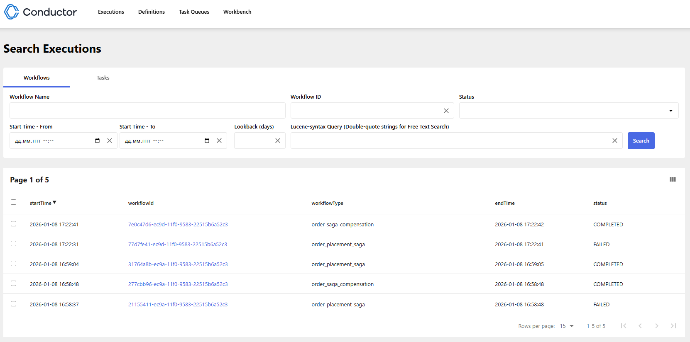
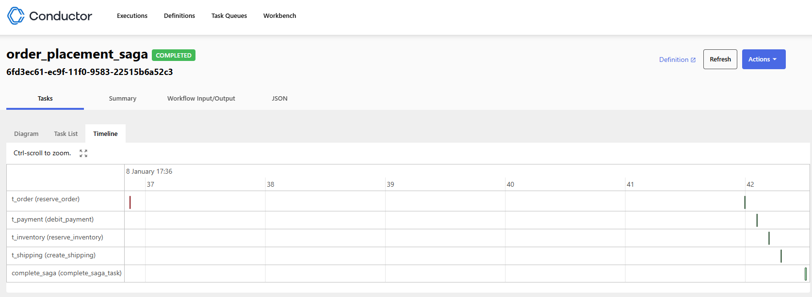

# Saga Conductor Demo

Приложение для демонстрации паттерна **Saga** (оркестровая модель) с использованием **Netflix Conductor OSS**, **Java 21** и **Spring Boot 4.0+**.

## Описание проекта
Проект реализует цепочку распределенных транзакций для системы заказов. Каждая стадия (Резервирование номера ордера (Order), Оплата (Payment), Склад (Inventory), Доставка (Shipping)) является отдельным воркером. Оркестратор Conductor управляет логикой выполнения и компенсации (отката) в случае сбоев.

## Технологический стек
- **Java 21**.
- **Spring Boot 4.0.1**
- **PostgreSQL 18.1**
- **Netflix Conductor OSS**: Оркестрация рабочих процессов.
- **Netflix Conductor Java SDK**: Кастомный набор классов и аннотаций для создания и упровления рабочего процесса.
- **MapStruct**: Маппинг сущностей в DTO/Records на этапе компиляции.
- **JPA Specifications**: Динамический поиск по сложным фильтрам (включая поиск внутри JSONB).

## Быстрый старт

### 1. Инфраструктура
Инфраструктура описанная в *docker-compose.yaml* включает в себя:
- **Conductor-server**
- **Conductor UI**
- **PostgreSql**
- **Saga-conductor-demo app** само приложение

Сборка с помощью Docker Compose:
```bash
docker compose build
```

**Conductor UI: http://localhost:5000**

**PostgreSQL: localhost:5432 (user: postgres, pass: postgres)**

### 2. Запуск приложения
```bash
docker compose up -d
```


## Тестирование API
1. Создание новой Саги
   Для старта процесса оформления заказа:
```bash
curl -X POST http://localhost:8090/api/orders/start-saga \
    -H "Content-Type: application/json" \
    -d '{
      "userId": "3fa85f64-5717-4562-b3fc-2c963f66afa6",
      "items": ["Laptop", "Mouse"],
      "amount": 1500.00,
      "address": "Minsk"
    }'
```
2. Проверка статуса саги воркфлоу
```bash
curl 'http://localhost:8090/api/orders/status/31764a8b-ec9a-11f0-9583-22515b6a52c3'
```
3. Поиск и агрегация (UserInfo)

Приложение предоставляет эндпоинт для сложного поиска по всем сущностям сразу.
Пример запроса (динамические фильтры):
```bash
curl "http://localhost:8090/api/orders/search?status=FAILED&item=Macbook&minAmount=1000&page=0&size=10&sort=createdAt,desc"
```

Доступные параметры фильтрации:
- userId: UUID пользователя.
- status: Статус шага (PENDING, COMPLETED, FAILED).
- minAmount / maxAmount: Диапазон суммы оплаты.
- item: Поиск по названию товара внутри JSONB-массива в таблице Inventory.
- address: Поиск по адресу доставки.

## Пример тестового прогона воркфлоу

1. Запуск воркфлоу
```bash
curl --location 'http://localhost:8090/api/orders/start-saga' \
--header 'Content-Type: application/json' \
--data '{
"userId": "e7a5e76b-8ab6-4765-aacb-be71667af8f1",
"amount": 100,
"items": ["toys1", "bycicles1"],
"address": "Minsk"
}'
```
Ответ:
```
Saga has launched. Workflow ID: 31764a8b-ec9a-11f0-9583-22515b6a52c3
```
Как выглядит на conductor ui


2. Проверка статуса воркфлоу
```bash
curl --location 'http://localhost:8090/api/orders/status/31764a8b-ec9a-11f0-9583-22515b6a52c3'
```
Ответ:
```json
{
    "status": "COMPLETED",
    "reason": "None",
    "tasks": [
        {
            "taskName": "reserve_order",
            "status": "COMPLETED"
        },
        {
            "taskName": "debit_payment",
            "status": "COMPLETED"
        },
        {
            "taskName": "reserve_inventory",
            "status": "COMPLETED"
        },
        {
            "taskName": "create_shipping",
            "status": "COMPLETED"
        },
        {
            "taskName": "complete_saga_task",
            "status": "COMPLETED"
        }
    ],
    "startTime": "2026-01-08T13:59:04.744Z",
    "endTime": "2026-01-08T13:59:05.454Z",
    "workflowId": "31764a8b-ec9a-11f0-9583-22515b6a52c3"
}
```
3. Поиск ордеров по критериям
```bash
curl --location 'http://localhost:8090/api/orders/search?status=COMPLETED&item=toys1&minAmount=100&page=0&size=10&sort=createdAt%2Cdesc'
```
Ответ:
```json
{
    "content": [
        {
            "id": "e7a5e76b-8ab6-4765-aacb-be71667af8f1",
            "orders": [
                {
                    "id": "cebdd5a8-a98c-4f05-805e-112c863e5966",
                    "userId": "e7a5e76b-8ab6-4765-aacb-be71667af8f1",
                    "status": "COMPLETED",
                    "note": "Create Order for user e7a5e76b-8ab6-4765-aacb-be71667af8f1",
                    "createdAt": "2026-01-08T13:59:04.82196",
                    "updatedAt": "2026-01-08T13:59:05.42755"
                }
            ],
            "payments": [
                {
                    "id": "086c8a33-4682-4c3c-8f4b-182a479ba0ac",
                    "userId": "e7a5e76b-8ab6-4765-aacb-be71667af8f1",
                    "orderId": "cebdd5a8-a98c-4f05-805e-112c863e5966",
                    "status": "COMPLETED",
                    "note": "Create Payment for order cebdd5a8-a98c-4f05-805e-112c863e5966",
                    "createdAt": "2026-01-08T13:59:04.922331",
                    "updatedAt": "2026-01-08T13:59:05.436534",
                    "amount": 100.00
                }
            ],
            "inventories": [
                {
                    "id": "9a563b7c-8781-494e-aae5-94424278a7a7",
                    "userId": "e7a5e76b-8ab6-4765-aacb-be71667af8f1",
                    "orderId": "cebdd5a8-a98c-4f05-805e-112c863e5966",
                    "status": "COMPLETED",
                    "note": "Create Payment for order cebdd5a8-a98c-4f05-805e-112c863e5966",
                    "createdAt": "2026-01-08T13:59:05.02333",
                    "updatedAt": "2026-01-08T13:59:05.441503",
                    "items": [
                        "toys1",
                        "bycicles1"
                    ]
                }
            ],
            "shipments": [
                {
                    "id": "796a43ed-0a85-461c-bdd8-13143311986e",
                    "userId": "e7a5e76b-8ab6-4765-aacb-be71667af8f1",
                    "orderId": "cebdd5a8-a98c-4f05-805e-112c863e5966",
                    "status": "COMPLETED",
                    "note": "Create Payment for order cebdd5a8-a98c-4f05-805e-112c863e5966",
                    "createdAt": "2026-01-08T13:59:05.227585",
                    "updatedAt": "2026-01-08T13:59:05.446193",
                    "address": "Minsk"
                }
            ]
        }
    ],
    "empty": false,
    "first": true,
    "last": true,
    "number": 0,
    "numberOfElements": 1,
    "pageable": {
        "offset": 0,
        "pageNumber": 0,
        "pageSize": 10,
        "paged": true,
        "sort": {
            "empty": false,
            "sorted": true,
            "unsorted": false
        },
        "unpaged": false
    },
    "size": 10,
    "sort": {
        "empty": false,
        "sorted": true,
        "unsorted": false
    },
    "totalElements": 1,
    "totalPages": 1
}
```
4. Запуск saga воруфлоу с эмитацией ошибки на степе inventory.
Вызов ошибки воркфлоу реализован случайным образом, но для демонстрации функционала была реализовано вызов ошибки через параметры
__"error": "error", "step": "inventory"__ 


```bash
curl --location 'http://localhost:8090/api/orders/start-saga' \
--header 'Content-Type: application/json' \
--data '{
    "userId": "e7a5e76b-8ab6-4765-aacb-be71667af8f1",
    "amount": 100,
    "items": ["toys1", "bycicles1"],
    "address": "Minsk",
    "error": "error",
    "step": "inventory"
}'
```
Ответ:
```
Saga has launched. Workflow ID: 77d7fe41-ec9d-11f0-9583-22515b6a52c3
```

Conductor ui:

На юай мы видим, что был выполнен компенсационный воркфлоу с UUID:7e0c47d6-ec9d-11f0-9583-22515b6a52c3

Так же на юай мы можем посмотреть как выполнялись таски на шкале времени

Из скриншота видим, что была попытка выполнить степ iventory еще раз, но и он упал с ошибкой поэтому был запущен компенсационный воркфлоу.

5. Как выглядит успешный saga воркфлоу с ретраем:

Видим что степ order выполнялся два раза, при этом второй раз был выполнен успешно и не привело к вызову компенсационного воркфлоу

Как выглядит для него вызов проверки статуса воркфлоу
```bash
curl --location 'http://localhost:8090/api/orders/status/6fd3ec61-ec9f-11f0-9583-22515b6a52c3'
```
Ответ:
```json
{
    "status": "COMPLETED",
    "reason": "None",
    "tasks": [
        {
            "taskName": "reserve_order",
            "status": "FAILED"
        },
        {
            "taskName": "reserve_order",
            "status": "COMPLETED"
        },
        {
            "taskName": "debit_payment",
            "status": "COMPLETED"
        },
        {
            "taskName": "reserve_inventory",
            "status": "COMPLETED"
        },
        {
            "taskName": "create_shipping",
            "status": "COMPLETED"
        },
        {
            "taskName": "complete_saga_task",
            "status": "COMPLETED"
        }
    ],
    "startTime": "2026-01-08T14:36:36.860Z",
    "endTime": "2026-01-08T14:36:42.515Z",
    "workflowId": "6fd3ec61-ec9f-11f0-9583-22515b6a52c3"
}
```
